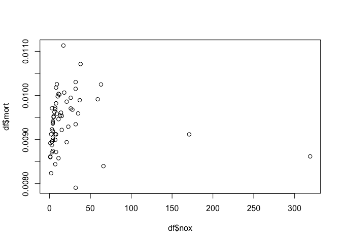
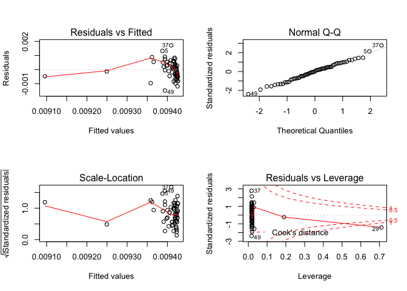
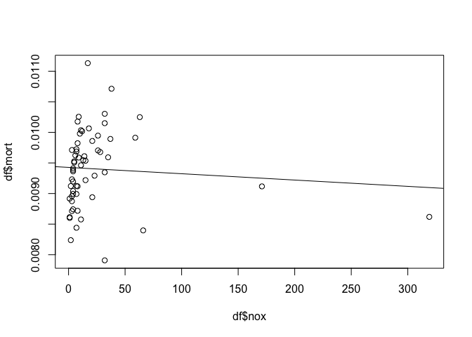
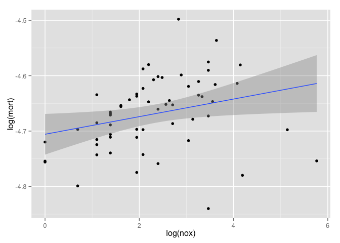
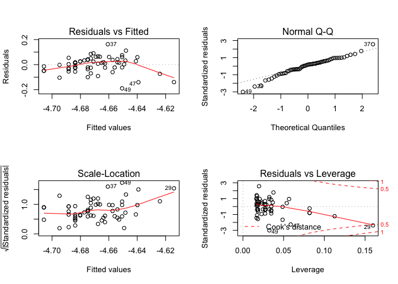
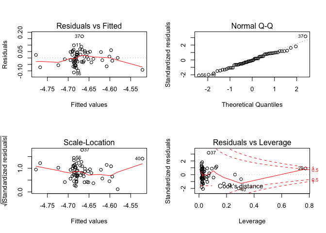
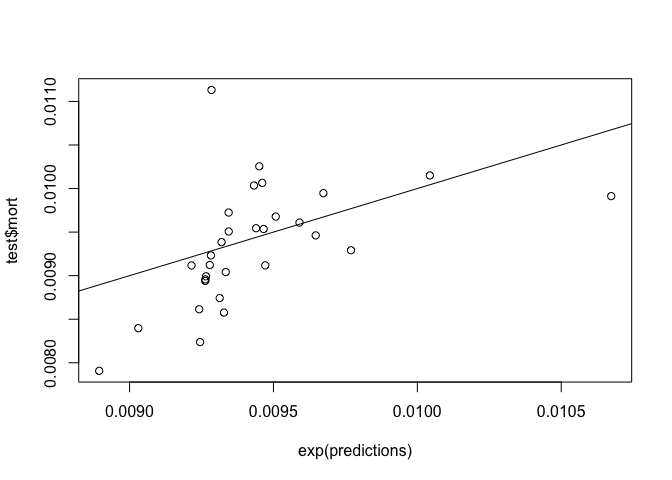

*Logarithmic transformations: the folder `pollution` contains mortality rates and various environmental factors from 60 U.S. metropolitan areas (see McDonald and Schwing, 1973). For this exercise we shall model mortality rate given nitric oxides, sulfur dioxide, and hydrocarbons as inputs. This model is an extreme oversimplification as it combines all sources of mortality and does not adjust for crucial factors such as age and smoking. We use it to illustrate log transformations in regression.*

``` r
require(foreign)
require(arm)
require(ggplot2)
```

``` r
df <- read.dta("http://www.stat.columbia.edu/~gelman/arm/examples/pollution/pollution.dta")

# scale `mort` (which is defined as "total age-adjusted mortality rate per 100,000")
df$mort <- df$mort / 100000

summary(df)
```

    ##       prec            jant            jult           ovr65       
    ##  Min.   :10.00   Min.   :12.00   Min.   :63.00   Min.   : 5.600  
    ##  1st Qu.:32.75   1st Qu.:27.00   1st Qu.:72.00   1st Qu.: 7.675  
    ##  Median :38.00   Median :31.50   Median :74.00   Median : 9.000  
    ##  Mean   :37.37   Mean   :33.98   Mean   :74.58   Mean   : 8.798  
    ##  3rd Qu.:43.25   3rd Qu.:40.00   3rd Qu.:77.25   3rd Qu.: 9.700  
    ##  Max.   :60.00   Max.   :67.00   Max.   :85.00   Max.   :11.800  
    ##       popn            educ            hous            dens     
    ##  Min.   :2.920   Min.   : 9.00   Min.   :66.80   Min.   :1441  
    ##  1st Qu.:3.210   1st Qu.:10.40   1st Qu.:78.38   1st Qu.:3104  
    ##  Median :3.265   Median :11.05   Median :81.15   Median :3567  
    ##  Mean   :3.263   Mean   :10.97   Mean   :80.91   Mean   :3876  
    ##  3rd Qu.:3.360   3rd Qu.:11.50   3rd Qu.:83.60   3rd Qu.:4520  
    ##  Max.   :3.530   Max.   :12.30   Max.   :90.70   Max.   :9699  
    ##       nonw           wwdrk            poor             hc        
    ##  Min.   : 0.80   Min.   :33.80   Min.   : 9.40   Min.   :  1.00  
    ##  1st Qu.: 4.95   1st Qu.:43.25   1st Qu.:12.00   1st Qu.:  7.00  
    ##  Median :10.40   Median :45.50   Median :13.20   Median : 14.50  
    ##  Mean   :11.87   Mean   :46.08   Mean   :14.37   Mean   : 37.85  
    ##  3rd Qu.:15.65   3rd Qu.:49.52   3rd Qu.:15.15   3rd Qu.: 30.25  
    ##  Max.   :38.50   Max.   :59.70   Max.   :26.40   Max.   :648.00  
    ##       nox              so2             humid            mort         
    ##  Min.   :  1.00   Min.   :  1.00   Min.   :38.00   Min.   :0.007907  
    ##  1st Qu.:  4.00   1st Qu.: 11.00   1st Qu.:55.00   1st Qu.:0.008984  
    ##  Median :  9.00   Median : 30.00   Median :57.00   Median :0.009437  
    ##  Mean   : 22.65   Mean   : 53.77   Mean   :57.67   Mean   :0.009404  
    ##  3rd Qu.: 23.75   3rd Qu.: 69.00   3rd Qu.:60.00   3rd Qu.:0.009832  
    ##  Max.   :319.00   Max.   :278.00   Max.   :73.00   Max.   :0.011132

### Part A

*Create a scatterplot of mortality rate versus level of nitric oxides. Do you think linear regression will fit these data well? Fit the regression and evaluate a residual plot from the regression.*

``` r
plot(df$nox, df$mort)
```



Linear regression looks like a good start for modeling this problem. The presence of outliers might however complicate our life. It would be advisable to transform the data.

``` r
m1 <- lm(mort ~ nox, data=df)
display(m1)
```

    ## lm(formula = mort ~ nox, data = df)
    ##             coef.est coef.se
    ## (Intercept) 0.01     0.00   
    ## nox         0.00     0.00   
    ## ---
    ## n = 60, k = 2
    ## residual sd = 0.00, R-Squared = 0.01

``` r
par(mfrow=c(2,2))
plot(m1)
```



We will now plot the regression line in order to see how well it fits the training data.

``` r
plot(df$nox, df$mort)
abline(m1)
```



### Part B

*Find an appropriate transformation that will result in data more appropriate for linear regression. Fit a regression to the transformed data and evaluate the new residual plot.*

``` r
m2 <- lm(log(mort) ~ log(nox), data=df)
display(m2)
```

    ## lm(formula = log(mort) ~ log(nox), data = df)
    ##             coef.est coef.se
    ## (Intercept) -4.71     0.02  
    ## log(nox)     0.02     0.01  
    ## ---
    ## n = 60, k = 2
    ## residual sd = 0.06, R-Squared = 0.08

We can appreaciate how using log transformation significantly improved R-squared in our model. The latter, even though is still pretty low (9%) is a signicantly good result considering we used only one predictor in our model.

``` r
ggplot(data=df, aes(x=log(nox), y=log(mort))) + geom_point() + 
  stat_smooth(method="lm", formula=y ~ x, se=TRUE)
```



As we can see from the plots below, residuals are now less normally distributed and still suffer from heteroschedasticity.

``` r
par(mfrow=c(2,2))
plot(m2)
```



### Part C

*Interpret the slope coefficient from the model you chose in (b).*

-   Intercept: The average mortality rate is \(exp(-4.71) = 0.0090 = 0.90\%\)
-   log(nox): For each 1% difference in nitric oxides, the predicted difference in mortality rate is +0.02%.

### Part D

*Now fit a model predicting mortality rate using levels of nitric oxides, sulfur dioxide, and hydrocarbons as inputs. Use appropriate transformations when helpful. Plot the fitted regression model and interpret the coefficients.*

Before proceding with fitting the model we checked if the predictors need to be scaled. As we can see from the different IQR, this is an advisable transformation, in order to facilitate the interpretation of the results.

``` r
# check IQR for the predictors we will use in our next model
apply(df[, c("hc", "nox", "so2")], FUN=IQR, MARGIN = 2)
```

    ##    hc   nox   so2 
    ## 23.25 19.75 58.00

``` r
# scale predictors
scale2 <- function(X) (X - mean(X)) / (2*sd(X))
df[, c("z.hc", "z.nox", "z.so2")] <- apply(df[, c("hc", "nox", "so2")], FUN=scale2, MARGIN = 2)

apply(df[, c("z.hc", "z.nox", "z.so2")], FUN=IQR, MARGIN = 2)
```

    ##      z.hc     z.nox     z.so2 
    ## 0.1263894 0.2131297 0.4574820

``` r
m3 <- lm(log(mort) ~ z.nox + z.so2 + z.hc, data=df)
display(m3)
```

    ## lm(formula = log(mort) ~ z.nox + z.so2 + z.hc, data = df)
    ##             coef.est coef.se
    ## (Intercept) -4.67     0.01  
    ## z.nox        0.30     0.12  
    ## z.so2        0.03     0.02  
    ## z.hc        -0.32     0.12  
    ## ---
    ## n = 60, k = 4
    ## residual sd = 0.05, R-Squared = 0.35

``` r
par(mfrow=c(2,2))
plot(m3)
```



The residuals of this model look quite good. Heteroschedasticity is almost absent and the assuption of normality for the residual is almost perfectly met. Because the outcome variable is log transformed we can interpret the coefficient as:

-   Intercept: The mortality rate for an individual exposed to average levels of nitric oxides, sulfur dioxide, and hydrocarbons is \(exp(-4.67) = 0.00937 = 0.94\%\)
-   z.nox: 1 standard deviation difference for nitric oxides, all rest being average, corresponds to a mortality rate \(exp(0.30) = 1.34985\) times higher, which is 35% more
-   z.so2: 1 standard deviation difference for sulfur dioxide corresponds to 0.03% increase in mortality rate
-   z.hc: 1 standard deviation difference in hydrocarbons, all rest being average, corresponds to a mortality rate \(exp(-0.32) = 0.726149\) times lower, which is a decrease of 27%

Due to the fact we scaled the predictors we can drive conclusions about which predictor is more important on explaining the variance of the outcome variable. The coefficients of `z.nox` and `z.hc` are much higher than `z.so2`, thus meaning the latter predictor is not that important in our final model.

### Part E

*Cross-validate: fit the model you chose above to the first half of the data and then predict for the second half. (You used all the data to construct the model in (d), so this is not really cross-validation, but it gives a sense of how the steps of cross-validation can be implemented.)*

``` r
# split dataset into training and test sets
train <- df[1:(nrow(df)/2), ]
test <- df[((nrow(df)/2)+1):nrow(df), ]

# fit linear model
m4 <- lm(log(mort) ~ z.nox + z.so2 + z.hc, data=train)
display(m4)
```

    ## lm(formula = log(mort) ~ z.nox + z.so2 + z.hc, data = train)
    ##             coef.est coef.se
    ## (Intercept) -4.66     0.01  
    ## z.nox        0.10     0.21  
    ## z.so2        0.05     0.03  
    ## z.hc        -0.13     0.20  
    ## ---
    ## n = 30, k = 4
    ## residual sd = 0.05, R-Squared = 0.38

``` r
# predict
predictions <- predict(m4, test)
cbind(predictions=exp(predictions), observed=test$mort)
```

    ##    predictions   observed
    ## 31 0.009461116 0.01006490
    ## 32 0.009241960 0.00861439
    ## 33 0.009769405 0.00929150
    ## 34 0.009328144 0.00857622
    ## 35 0.009590416 0.00961009
    ## 36 0.009282680 0.00923234
    ## 37 0.009284681 0.01113156
    ## 38 0.009673537 0.00994648
    ## 39 0.010043378 0.01015023
    ## 40 0.010673597 0.00991290
    ## 41 0.009263130 0.00893991
    ## 42 0.009319622 0.00938500
    ## 43 0.009646836 0.00946185
    ## 44 0.009450756 0.01025502
    ## 45 0.009313130 0.00874281
    ## 46 0.009465939 0.00953560
    ## 47 0.009030423 0.00839709
    ## 48 0.009215209 0.00911701
    ## 49 0.008894473 0.00790733
    ## 50 0.009265700 0.00899264
    ## 51 0.009334211 0.00904155
    ## 52 0.009344545 0.00950672
    ## 53 0.009344234 0.00972464
    ## 54 0.009278740 0.00912202
    ## 55 0.009507915 0.00967803
    ## 56 0.009245027 0.00823764
    ## 57 0.009432453 0.01003502
    ## 58 0.009263294 0.00895696
    ## 59 0.009471499 0.00911817
    ## 60 0.009439589 0.00954442

``` r
plot(exp(predictions), test$mort)
abline(a=0, b=1)
```



``` r
# compute RMSE
sqrt(mean((test$mort-exp(predictions))^2))
```

    ## [1] 0.0005810359
