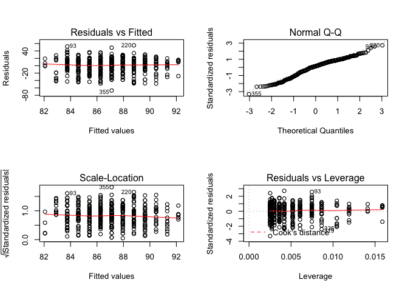
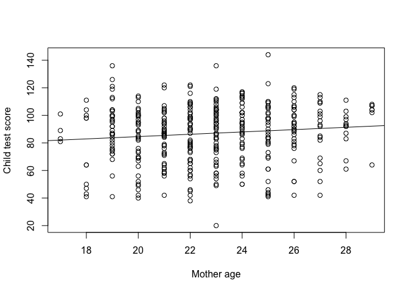
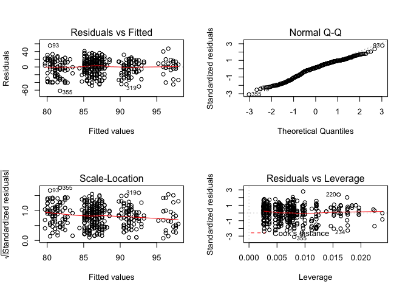
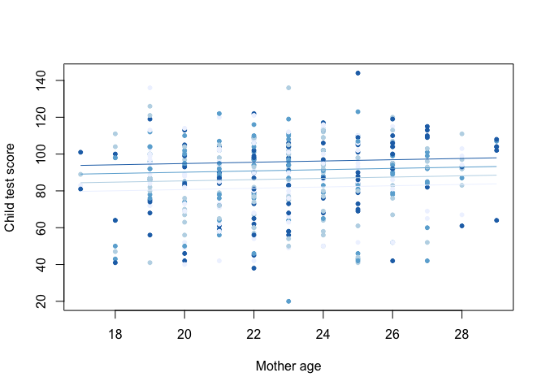
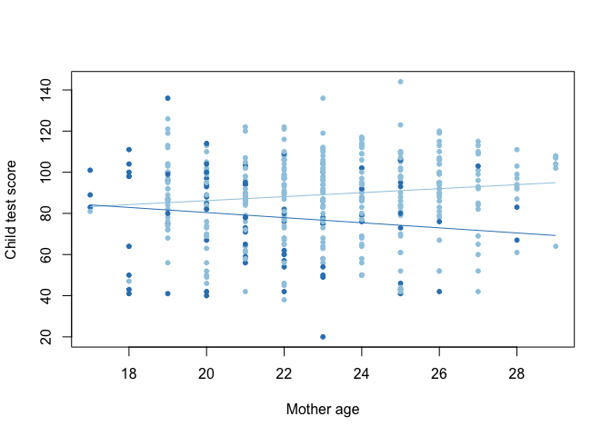
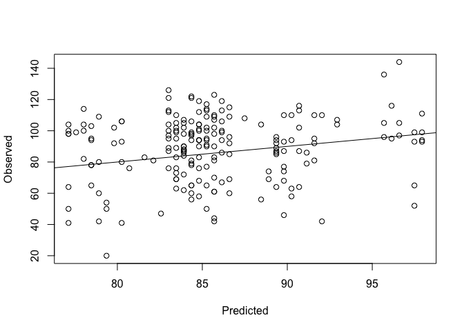

The `child.iq` folder contains a subset of the children and mother data discussed earlier in the chapter. You have access to children’s test scores at age 3, mother’s education, and the mother’s age at the time she gave birth for a sample of 400 children. The data are a Stata file which you can read into R by saving in your working directory and then typing the following:

``` r
iq.data <- read.dta ("child.iq.dta")
```

### Part a

*Fit a regression of child test scores on mother’s age, display the data and fitted model, check assumptions, and interpret the slope coefficient. When do you recommend mothers should give birth? What are you assuming in making these recommendations?*

(Generalized) Linear models make some strong assumptions concerning the data structure:

1.  Independance of each data points
2.  Correct distribution of the residuals
3.  Correct specification of the variance structure
4.  Linear relationship between the response and the linear predictor

For simple linear models the last three points mean that the residuals should be normally distributed, the variance should be homogenous across the fitted values of the model and for each predictors separately, and the y’s should be linearly related to the predictors. In R checking these assumptions from a lm and glm object is fairly easy.

``` r
require("foreign")
require("arm")
```

``` r
iq <- read.dta("http://www.stat.columbia.edu/~gelman/arm/examples/child.iq/child.iq.dta")
head(iq)
```

    ##   ppvt educ_cat momage
    ## 1  120        2     21
    ## 2   89        1     17
    ## 3   78        2     19
    ## 4   42        1     20
    ## 5  115        4     26
    ## 6   97        1     20

``` r
m1 <- lm(ppvt ~ momage, data=iq)
display(m1)
```

    ## lm(formula = ppvt ~ momage, data = iq)
    ##             coef.est coef.se
    ## (Intercept) 67.78     8.69  
    ## momage       0.84     0.38  
    ## ---
    ## n = 400, k = 2
    ## residual sd = 20.34, R-Squared = 0.01

``` r
par(mfrow=c(2,2))
plot(m1)
```



The top-left and top-right graphs are the most important one, the top-left graph check for the homogeneity of the variance and the linear relation, if you see no pattern in this graph (i.e. if this graph looks like stars in the sky), then your assumptions are met. In our case the graphs looks sufficiently good.

The second graph checks for the normal distribution of the residuals, the points should fall on a line. Also in this case our plot seems to pass the test although the tails are not perfectly normal.

The bottom-left graph is similar to the top-left one, the y-axis is changed, this time the residuals are square-root standardized (`?rstandard`) making it easier to see heterogeneity of the variance. Also in this case the test is passed.

The fourth one allows detecting points that have a too big impact on the regression coefficients and that should be removed. There is no outlier among the residuals, which is consistent to what we saw in the top-right graph.

Returning to the exercise text, when would I recommend mothers should give birth? What are my assumptions in making these recommendations? The next plot will help answer these questions.

``` r
plot(iq$momage, iq$ppvt, xlab="Mother age", ylab="Child test score")
abline(m1)
```



Based on the above graph and the results of the regression model, I would suggest mothers should give birth on their late 20s. Unfortunately we know that mother's age is not a strong predictor for child test score, so we can't really rely on the above simplistic model. Nonetheless, the assumption we should make if we plan to rely on the above model is that the model is valid and no other predictors are left out. Inspecting the model we can notice how 1 year increase in `momage` is associated with an increase in the output variable (`ppvt`) of 0.84. This, at least, tells us a little more about the relationship between these two variables.

### Part b

*Repeat this for a regression that further includes mother’s education, interpreting both slope coefficients in this model. Have your conclusions about the timing of birth changed?*

``` r
m2 <- lm(ppvt ~ momage + educ_cat, data=iq)
display(m2)
```

    ## lm(formula = ppvt ~ momage + educ_cat, data = iq)
    ##             coef.est coef.se
    ## (Intercept) 69.16     8.57  
    ## momage       0.34     0.40  
    ## educ_cat     4.71     1.32  
    ## ---
    ## n = 400, k = 3
    ## residual sd = 20.05, R-Squared = 0.04

``` r
par(mfrow=c(2,2))
plot(m2)
```



As we can see from the results of our extended model, the inclusion of `educ_cat` into the model helps on explaining almost 3% of the data's variation (R-squared increased from 1% to 4%). This is a good step forward. We also must notice how the coefficient of `momage`, although maintaining its positive sign, is now considerably smaller (from 0.84 to 0.34), but is also not very signicant. If the mother attended an additional education level, the child will have a 4.71 \(\pm\) 1.32 higher test score (see graph below).

``` r
colours = c('#eff3ff','#bdd7e7','#6baed6','#2171b5')
plot(iq$momage, iq$ppvt, xlab="Mother age", ylab="Child test score", col=colours, pch=20)
for (i in 1:4) {
  curve(cbind(1, x, i) %*% coef(m2), add=TRUE, col=colours[i])
}
```



Indeed, the inclusion of `educ_cat` in our model had a beneficial effect. I still believe, based on the exercise data, mothers should give birth on their late 20s. However, the model clearly states that for mothers which have higher education generally have children which score better on the IQ test, anything else being equal.

### Part c

*Now create an indicator variable reflecting whether the mother has completed high school or not. Consider interactions between the high school completion and mother’s age in family. Also, create a plot that shows the separate regression lines for each high school completion status group.*

``` r
# create binary feature to capture if the mother completed high school
iq$hs <- ifelse(iq$educ_cat >= 2, 1, 0)

m3 <- lm(ppvt ~ hs * momage, data=iq)
display(m3)
```

    ## lm(formula = ppvt ~ hs * momage, data = iq)
    ##             coef.est coef.se
    ## (Intercept) 105.22    17.65 
    ## hs          -38.41    20.28 
    ## momage       -1.24     0.81 
    ## hs:momage     2.21     0.92 
    ## ---
    ## n = 400, k = 4
    ## residual sd = 19.85, R-Squared = 0.06

``` r
colors <- ifelse(iq$hs == 1, "#9ecae1", "#3182bd")
plot(iq$momage, iq$ppvt, xlab="Mother age", ylab="Child test score", col=colors, pch=20)
curve(cbind(1, 1, x, 1 * x) %*% coef(m3), add=TRUE, col="#9ecae1") # completed high school
curve(cbind(1, 0, x, 0 * x) %*% coef(m3), add=TRUE, col="#3182bd") # didn't complete high school
```



### Part d

*Finally, fit a regression of child test scores on mother’s age and education level for the first 200 children and use this model to predict test scores for the next 200. Graphically display comparisons of the predicted and actual scores for the final 200 children.*

``` r
# split data set into training and test sets
iq.train <- iq[1:200, ]
iq.test <- iq[201:dim(iq)[1], ]

# fit linear model
m4 <- lm(ppvt ~ momage + educ_cat, data=iq.train)
display(m4)
```

    ## lm(formula = ppvt ~ momage + educ_cat, data = iq.train)
    ##             coef.est coef.se
    ## (Intercept) 63.63    11.82  
    ## momage       0.45     0.55  
    ## educ_cat     5.44     1.82  
    ## ---
    ## n = 200, k = 3
    ## residual sd = 19.58, R-Squared = 0.06

``` r
# make predictions
iq.pred <- predict(m4, iq.test)
plot(iq.pred, iq.test$ppvt, xlab="Predicted", ylab="Observed")
abline(a=0, b=1)
```


