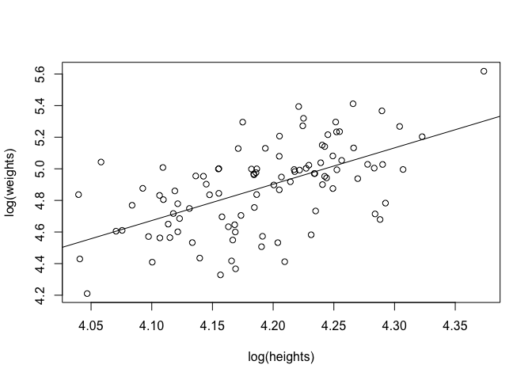

# Chapter 4, Problem 1 (Gelman & Hill)
Gianluca Rossi  
31 October 2015  

Logarithmic transformation and regression: consider the following regression: 

$$log(\text{weight}) = −3.5 + 2.0 * log(\text{height}) + \text{error,}$$

with errors that have standard deviation 0.25. Weights are in pounds and heights are in inches.

### Part A
*Fill in the blanks: approximately 68% of the persons will have weights within a factor of `__` and `__` of their predicted values from the regression.*

`-(exp(0.25)) = -1.28` and `exp(0.25) = 1.28`

### Part B
*Draw the regression line and scatterplot of log(weight) versus log(height) that make sense and are consistent with the fitted model. Be sure to label the axes of your graph.*


```r
require(arm)
```


```r
# create vector of log heights (where 50% of the population is female)
female.heights <- rnorm(n=50, mean=63.8, sd=3) # females
male.heights <- rnorm(n=50, mean=69.7, sd=3.1) # males
heights <- c(female.heights, male.heights) 
log.heights <- log(heights)

# create a vector of log weights based on the formula given in the the exercise
log.weights <- -3.5 + 2 * log.heights + rnorm(n=length(heights), mean=0, sd=0.25)

# fit linear model
df <- data.frame(cbind(log.weights=log.weights, log.heights=log.heights))
m1 <- lm(log.weights ~ log.heights, data=df)
display(m1)
```

```
## lm(formula = log.weights ~ log.heights, data = df)
##             coef.est coef.se
## (Intercept) -4.52     1.65  
## log.heights  2.25     0.39  
## ---
## n = 100, k = 2
## residual sd = 0.25, R-Squared = 0.25
```

```r
# plot regression line
plot(log.heights, log.weights, xlab="log(heights)", ylab="log(weights)")
abline(m1)
```

 
