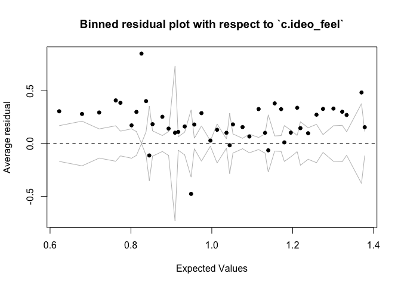
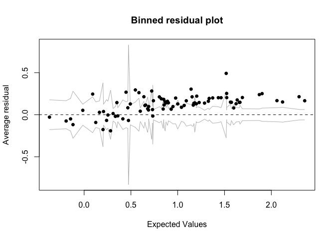

# Chapter 5, Problem 1 (Gelman & Hill)
Gianluca Rossi  
15 November 2015  

*The folder `nes` contains the survey data of presidential preference and income for the 1992 election analyzed in Section 5.1, along with other variables including sex, ethnicity, education, party identification, and political ideology.*


```r
require(arm)
require(foreign)
```


```r
df <- read.dta("http://www.stat.columbia.edu/~gelman/arm/examples/nes/nes5200_processed_voters_realideo.dta")
```

### Part A

*Fit a logistic regression predicting support for Bush given all these inputs. Consider how to include these as regression predictors and also consider possible interactions.*


```r
# scale `ideo_feel` to make it comparable to other factors
df$c.ideo_feel <- (df$ideo_feel - mean(df$ideo_feel, na.rm=TRUE)) / (2 * sd(df$ideo_feel, na.rm=TRUE))

# fit a model which includes sex, ethnicity, education, party identification, and political ideology
m1 <- glm(vote ~ female + race + educ1 + partyid7 + c.ideo_feel, data=df, family=binomial(link="logit"))
display(m1)
```

```
## glm(formula = vote ~ female + race + educ1 + partyid7 + c.ideo_feel, 
##     family = binomial(link = "logit"), data = df)
##                                               coef.est coef.se
## (Intercept)                                    1.15     0.06  
## female                                        -0.03     0.03  
## race2. black                                  -0.38     0.05  
## race3. asian                                  -0.37     0.15  
## race4. native american                        -0.48     0.10  
## race5. hispanic                               -0.59     0.07  
## race7. other                                  -0.29     0.27  
## educ12. high school (12 grades or fewer, incl  0.21     0.05  
## educ13. some college(13 grades or more,but no  0.51     0.05  
## educ14. college or advanced degree (no cases   1.01     0.06  
## partyid72. weak democrat                      -0.57     0.05  
## partyid73. independent-democrat               -0.66     0.06  
## partyid74. independent-independent            -1.00     0.06  
## partyid75. independent-republican             -0.51     0.06  
## partyid76. weak republican                    -0.50     0.06  
## partyid77. strong republican                   0.10     0.07  
## c.ideo_feel                                    0.17     0.03  
## ---
##   n = 25053, k = 17
##   residual deviance = 27565.7, null deviance = 28784.9 (difference = 1219.2)
```

All predictors but female are significant. Because some coefficients are quire large, we will create two possibly meaningful interactions. 


### Part B

*Evaluate and compare the different models you have fit. Consider coefficient estimates and standard errors, residual plots, and deviances.*

We will first start exploring the interactions `race:female` and `partyid7:female`, which could intuitively make sense.


```r
m2 <- glm(vote ~ female + race + educ1 + partyid7 + c.ideo_feel + race:female, data=df, family=binomial(link="logit"))
display(m2)
```

```
## glm(formula = vote ~ female + race + educ1 + partyid7 + c.ideo_feel + 
##     race:female, family = binomial(link = "logit"), data = df)
##                                               coef.est coef.se
## (Intercept)                                    1.16     0.06  
## female                                        -0.04     0.03  
## race2. black                                  -0.35     0.07  
## race3. asian                                  -0.57     0.21  
## race4. native american                        -0.45     0.16  
## race5. hispanic                               -0.65     0.11  
## race7. other                                  -0.58     0.37  
## educ12. high school (12 grades or fewer, incl  0.21     0.05  
## educ13. some college(13 grades or more,but no  0.52     0.05  
## educ14. college or advanced degree (no cases   1.02     0.06  
## partyid72. weak democrat                      -0.57     0.05  
## partyid73. independent-democrat               -0.66     0.06  
## partyid74. independent-independent            -1.00     0.06  
## partyid75. independent-republican             -0.51     0.06  
## partyid76. weak republican                    -0.50     0.06  
## partyid77. strong republican                   0.10     0.07  
## c.ideo_feel                                    0.17     0.03  
## female:race2. black                           -0.04     0.09  
## female:race3. asian                            0.38     0.30  
## female:race4. native american                 -0.05     0.20  
## female:race5. hispanic                         0.11     0.15  
## female:race7. other                            0.61     0.55  
## ---
##   n = 25053, k = 22
##   residual deviance = 27562.0, null deviance = 28784.9 (difference = 1222.9)
```

Surprisingly, the interaction term `race:female` is not significant. This is also reflected by the change in deviance which is smaller than the increase in $k$. We can see in fact that $\delta_{k} = 22 - 17 =5$ and that $\delta_{deviation} = (1222.9 - 1219.2) =  3.7$. 


```r
m3 <- glm(vote ~ female + race + educ1 + partyid7 + c.ideo_feel + partyid7:female, data=df, family=binomial(link="logit"))
display(m3)
```

```
## glm(formula = vote ~ female + race + educ1 + partyid7 + c.ideo_feel + 
##     partyid7:female, family = binomial(link = "logit"), data = df)
##                                               coef.est coef.se
## (Intercept)                                    1.16     0.07  
## female                                        -0.05     0.07  
## race2. black                                  -0.38     0.05  
## race3. asian                                  -0.36     0.15  
## race4. native american                        -0.48     0.10  
## race5. hispanic                               -0.59     0.07  
## race7. other                                  -0.29     0.27  
## educ12. high school (12 grades or fewer, incl  0.21     0.05  
## educ13. some college(13 grades or more,but no  0.51     0.05  
## educ14. college or advanced degree (no cases   1.02     0.06  
## partyid72. weak democrat                      -0.57     0.07  
## partyid73. independent-democrat               -0.60     0.08  
## partyid74. independent-independent            -1.01     0.08  
## partyid75. independent-republican             -0.50     0.09  
## partyid76. weak republican                    -0.54     0.08  
## partyid77. strong republican                  -0.03     0.09  
## c.ideo_feel                                    0.17     0.03  
## female:partyid72. weak democrat                0.00     0.10  
## female:partyid73. independent-democrat        -0.11     0.11  
## female:partyid74. independent-independent      0.02     0.11  
## female:partyid75. independent-republican      -0.02     0.12  
## female:partyid76. weak republican              0.07     0.11  
## female:partyid77. strong republican            0.23     0.12  
## ---
##   n = 25053, k = 23
##   residual deviance = 27557.8, null deviance = 28784.9 (difference = 1227.1)
```

Also this interaction term doesn't look particularly informative. We still believe howerver that sex is a meaningful predictor and that somehow it captures some information. We will last try the interaction term between sex and education. In our last model, described in Part C, we will see that the interaction term `female:educ1` is indeed significant.

We will now investigate a bit further the `c.ideo_feel` predictor. This started as a routine check but resolved to be very interesting. Even though the predictor is highly significant, from a binned residual plot we notice the residuals are significantly positive along the entire distribution, meaning that we overestimate the probability of a voter to be a Democrat. 


```r
sam <- glm(vote~c.ideo_feel, data=df, family=binomial(link="logit"))
binnedplot(predict(sam), resid(sam), main="Binned residual plot with respect to `c.ideo_feel`")
```

 

This is very interesting, because the predictor has a big positive and statistically significant coefficient. We would have never thought about removing the coefficient from the model only looking at the model results. 

On the other hand, this makes to us intuitive sense. We don't believe Democrats are in general more ideologically biased than Republicans. Thus, we wouldn't expect such a predictor to be that informative. We will see that removing `c.ideo_feel` from our model will improve massively the difference between null and
residual deviance.

### Part C

*For your chosen model, discuss and compare the importance of each input variable in the prediction.*

Our final model includes all the input variables we saw in Part B, but with a different interraction term between sex and education level. This interraction has proven to be statistically significant not only at the interraction level, but also when we consider sex alone. I'm not very familiar with the U.S. politics and affiliations, but it is reassuring that the coefficients for the interaction terms between the different levels of education and sex share the same sign.


```r
m4 <- glm(vote ~ female + race + educ1 + partyid7 + female:educ1, data=df, family=binomial(link="logit"))
display(m4)
```

```
## glm(formula = vote ~ female + race + educ1 + partyid7 + female:educ1, 
##     family = binomial(link = "logit"), data = df)
##                                                      coef.est coef.se
## (Intercept)                                           1.33     0.05  
## female                                               -0.40     0.06  
## race2. black                                         -0.48     0.04  
## race3. asian                                         -0.52     0.14  
## race4. native american                               -0.54     0.09  
## race5. hispanic                                      -0.60     0.07  
## race7. other                                         -0.46     0.21  
## educ12. high school (12 grades or fewer, incl         0.01     0.05  
## educ13. some college(13 grades or more,but no         0.34     0.06  
## educ14. college or advanced degree (no cases          0.79     0.06  
## partyid72. weak democrat                             -0.60     0.04  
## partyid73. independent-democrat                      -0.69     0.05  
## partyid74. independent-independent                   -0.98     0.05  
## partyid75. independent-republican                    -0.46     0.05  
## partyid76. weak republican                           -0.44     0.04  
## partyid77. strong republican                          0.24     0.05  
## female:educ12. high school (12 grades or fewer, incl  0.35     0.07  
## female:educ13. some college(13 grades or more,but no  0.37     0.08  
## female:educ14. college or advanced degree (no cases   0.34     0.09  
## ---
##   n = 36397, k = 19
##   residual deviance = 40907.4, null deviance = 42826.4 (difference = 1919.0)
```

This is how we interpret the results of our final model:

* `intercept`: a white strong democrat male, with unknown education level and average political ideology would have a $logit^{-1}(1.33) = 0.7908 = 79.08\%$ probability to vote for George W. Bush
* `female`: female voters, all rest being equal are generally $\frac{-0.40}{4} = -0.100 = -10.00\%$ more likely to vote democrats (please note the negative increase, thus this is to all effects a decrease in probability)
* `race`: if we divide by 4 the coefficients of each level of this predictor, we obtain a crude estimated difference in probability to vote democrat on each etnic group. For instance blacks are $\frac{-0.48}{4} = -0.120 = -12.00\%$ more likely to vote for a democrat candidate (again, note the negative sign). One thing we can infer, is that democract voters are generally whites. 
* `educ1`: the higher the educational level, the more the electorate tends to vote for Democrats. In particular, college or advanced degree holders, are $\frac{0.79}{4} = 0.1975 = 19.75\%$ more likely to vote for the Democrat candidate (on that year, George W. Bush)
* `partyid7`: party identification, not surprisingly is a strong predictor. At every other level of this factor variable we see a significant decrease in odds to vote for the Democrat candidate. Surprisingly, the coefficient for `strong republican` is positive. This is controversial and tell us our model is not yet perfect. Analysing the binned residual we will have a further evidence of this 
* `female:educ1`: this can be interpreted in two ways. Looking from one direction, for each additional level of education, the value $~0.35$ is added to the coefficient for `female`. We have already seen that the coefficient for `female` is negative, thus we can understand the interaction as saying that the importance of `female` as a predictor decreases for females with higher education level. Looking at it the other way, for each increase in educational level, if the subject is a female, the importance of the coefficient for `educ1` becomes more important
  

```r
binnedplot(predict(m4), resid(m4))
```

 

As we said already, we believe our model is not yet perfect and overestimate the probability to vote for Democrats. The binned residuals plot clearly highlight this.
